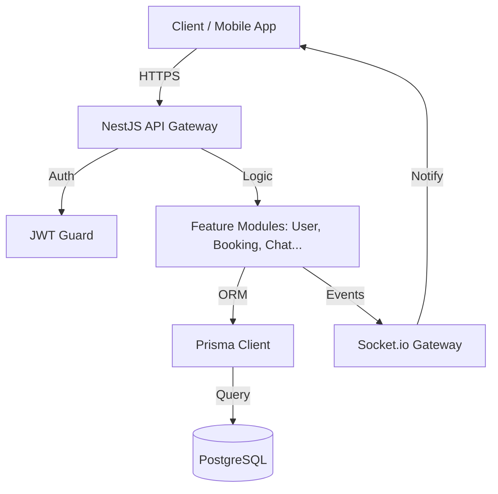

# SaaS Marketplace Backend 🚀

## Introduction
Ce projet est le cœur du système **SaaS Marketplace**, une plateforme robuste permettant la mise en relation entre prestataires de services et clients. Il offre des fonctionnalités de géolocalisation, de gestion de réservations par QR Code, de messagerie en temps réel et de gestion d'annonces classées.

## Fonctionnalités Clés
- 🔐 **Authentification & Sécurité** : Gestion des utilisateurs (Client, Prestataire, Admin) via JWT.
- 💳 **Abonnements & Crédits** : Système de monétisation pour les prestataires.
- 🛠️ **Services & Leads** : Publication de services géolocalisés.
- 📅 **Réservations (Bookings)** : Cycle de vie complet des interventions (RDV/Urgence).
- 📷 **Validation par QR Code** : Sécurisation des interventions via scan mutuel (Client/Presta).
- 💬 **Messagerie Temps Réel** : Chat type WhatsApp avec support de fichiers et audio.
- 📣 **Annonces** : Section dédiée aux petites annonces (Vente, Location, Réservation).
- 🤖 **Intelligence Artificielle** : Recherche assistée par IA (Tensorflow.js) pour l'identification de services/objets.
- 📂 **FileManager** : Système centralisé de gestion de fichiers et d'images.

## Stack Technique
- **Framework** : [NestJS](https://nestjs.com/) (v11)
- **ORM** : [Prisma](https://www.prisma.io/)
- **Base de Données** : PostgreSQL
- **Temps Réel** : Socket.io
- **Sécurité** : Passport JS (JWT), Helmet, Throttler (Rate Limiting)
- **Logique IA** : Tensorflow.js
- **Logging** : Winston (avec rotation journalière)
- **Documentation** : Swagger UI

## Architecture Flow


## Installation et Démarrage
1. **Cloner le projet**
2. **Installer les dépendances** :
   ```bash
   npm install
   ```
3. **Configurer l'environnement** :
   Créer un fichier `.env` basé sur `.env.example` (indiquer `DATABASE_URL`, `JWT_SECRET`, etc.).
4. **Générer le client Prisma** :
   ```bash
   npx prisma generate
   ```
5. **Lancer les migrations** (si nécessaire) :
   ```bash
   npx prisma migrate dev
   ```
6. **Démarrer en mode développement** :
   ```bash
   npm run start:dev
   ```

## Documentation API
Une fois l'application lancée, la documentation interactive est disponible via Swagger UI à l'adresse suivante :
`http://localhost:4000/api/v1/docs`

## Gouvernance des Données
Les données sont structurées pour garantir l'intégrité et la traçabilité :
- **Utilisateurs** : Séparation stricte des rôles et gestion des crédits.
- **Réservations** : Historique complet avec horodatage et statuts d'intervention.
- **Fichiers** : Stockage organisé par type de cible (`userFiles`, `servicesFiles`, etc.).

## Gouvernance et Sécurité
- **Validation** : Tous les payloads sont validés via `class-validator`.
- **Exceptions** : Filtre global pour uniformiser les erreurs API.
- **Rate Limiting** : Protection contre les attaques par force brute.
- **CORS** : Configuration dynamique des origines autorisées.

## Status Codes (BaseResponse)
Toutes les réponses API suivent le format `BaseResponse` :
- `200/201` : Succès (OK / Created).
- `400` : Requête invalide (Validation).
- `401` : Non autorisé (Auth).
- `403` : Interdit (Permissions).
- `404` : Ressource non trouvée.

---
*Développé avec ❤️ pour une expérience SaaS premium.*
